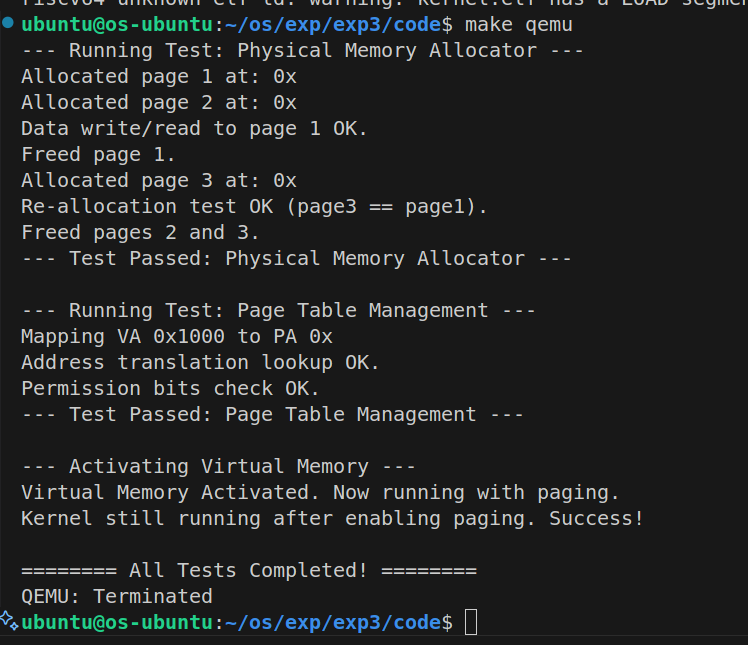

# 实验三：页表与内存管理 - 实验报告

**实验时间：** 2025年9月

**实验环境：** QEMU RISC-V 模拟器

---

## 一、实验目标

本实验通过深入分析 xv6 的内存管理系统，理解虚拟内存的工作原理，独立实现物理内存分配器和页表管理系统。具体目标包括：

1. 深入理解 RISC-V Sv39 分页机制
2. 实现基于空闲链表的物理内存分配器
3. 实现三级页表的创建、遍历和映射功能
4. 启用虚拟内存并验证系统正常运行

---

## 二、系统设计部分

### 2.1 架构设计说明

本实验的内存管理系统采用分层设计，主要包含两个核心模块：

#### 物理内存管理层（kalloc.c）
- **功能定位：** 管理物理内存页面的分配与释放
- **设计思路：** 使用简单的空闲链表（Free List）管理所有可用物理页面
- **接口设计：**
  - `kinit()`: 初始化物理内存分配器
  - `kalloc()`: 分配一个物理页面（4KB）
  - `kfree()`: 释放一个物理页面

#### 虚拟内存管理层（vm.c）
- **功能定位：** 实现 Sv39 三级页表的创建、遍历和映射
- **设计思路：** 提供页表操作的抽象接口，隐藏硬件细节
- **接口设计：**
  - `walk()`: 遍历页表，查找或创建页表项
  - `mappages()`: 建立虚拟地址到物理地址的映射
  - `kvminit()`: 创建内核页表
  - `kvminithart()`: 激活页表（写入 satp 寄存器）

#### 内存布局设计（memlayout.h）

```
物理内存布局（128MB RAM）:
┌─────────────────────┐ 0x88000000 (PHYSTOP)
│   可分配物理内存       │
│   由 kalloc 管理     │
├─────────────────────┤ end (BSS段结束)
│   内核 BSS 段        │
├─────────────────────┤ etext
│   内核数据段          │
├─────────────────────┤ etext
│   内核代码段          │
├─────────────────────┤ 0x80000000 (KERNBASE)
│   （未使用）          │
├─────────────────────┤ 0x10001000
│   UART 设备          │
└─────────────────────┘ 0x10000000 (UART0)
```

### 2.2 关键数据结构

#### 1. 空闲页链表节点（struct run）

```c
struct run {
    struct run *next;  // 指向下一个空闲页
};
```

**设计巧妙之处：**
- 直接利用空闲页自身的前 8 字节存储链表指针
- 无需额外的元数据存储空间
- 实现简单，内存开销为零

#### 2. 物理内存管理器（kmem）

```c
struct {
    struct run *freelist;  // 空闲页链表头
} kmem;
```

**设计特点：**
- 单链表头指针，指向第一个空闲页
- 分配时从链表头取出页面（O(1)）
- 释放时将页面插入链表头（O(1)）

#### 3. 页表类型定义

```c
typedef uint64* pagetable_t;  // 页表指针
typedef uint64 pte_t;          // 页表项
```

**设计考虑：**
- `pagetable_t` 是指向 512 个 64 位页表项的指针
- 每个页表占用一个物理页（4KB = 512 × 8 字节）
- 使用 `uint64` 确保与 RISC-V 硬件格式一致

### 2.3 与 xv6 对比分析

| 对比维度 | 本实验实现 | xv6 实现 | 差异说明 |
|---------|-----------|---------|---------|
| **物理内存分配** | 简单空闲链表 | 简单空闲链表 + 自旋锁 | xv6 支持多核，需要加锁保护 |
| **页表管理** | 单一内核页表 | 内核页表 + 每进程页表 | xv6 支持用户进程，需要隔离 |
| **内存范围** | 固定 128MB | 动态检测硬件配置 | xv6 更通用，本实验简化处理 |
| **错误处理** | 基本检查 | 完善的 panic 机制 | xv6 有更完善的调试支持 |
| **性能优化** | 无 | 无 | 两者都采用最简单的实现 |

**核心相似点：**
1. 都采用 Sv39 三级页表
2. 物理内存分配器算法完全一致
3. 页表遍历逻辑相同
4. 内核采用恒等映射（虚拟地址 = 物理地址）

### 2.4 设计决策理由

#### 决策 1：选择简单空闲链表而非 Buddy System

**理由：**
- 实现复杂度低，易于理解和调试
- 对于小规模系统（128MB），碎片问题不明显
- 分配/释放性能均为 O(1)，满足基本需求
- xv6 也采用此方案，经过长期验证

**权衡：**
- 优点：代码简洁，无外部碎片（只分配整页）
- 缺点：无法合并相邻空闲页，不支持大页分配

#### 决策 2：内核使用恒等映射

**理由：**
- 简化地址转换：物理地址 = 虚拟地址
- 便于访问硬件设备（如 UART）
- 启用分页前后代码无需修改
- 符合 RISC-V 常见实践

**实现方式：**
```c
// 代码段：虚拟地址 [KERNBASE, etext) -> 物理地址 [KERNBASE, etext)
mappages(kernel_pagetable, KERNBASE, KERNBASE, 
         (uint64)etext - KERNBASE, PTE_R | PTE_X);

// 数据段：虚拟地址 [etext, PHYSTOP) -> 物理地址 [etext, PHYSTOP)
mappages(kernel_pagetable, (uint64)etext, (uint64)etext, 
         PHYSTOP - (uint64)etext, PTE_R | PTE_W);
```

#### 决策 3：页表按需创建

**理由：**
- `walk()` 函数的 `alloc` 参数控制是否创建新页表
- 节省内存：仅在需要映射时才分配中间级页表
- 灵活性：查找时可避免意外分配

**实现细节：**
```c
pte_t* walk(pagetable_t pagetable, uint64 va, int alloc) {
    for (int level = 2; level > 0; level--) {
        pte_t *pte = &pagetable[PX(level, va)];
        if (*pte & PTE_V) {
            pagetable = (pagetable_t)PTE2PA(*pte);
        } else {
            if (!alloc) return NULL;  // 不创建，直接返回
            // 分配新页表页
            pagetable = (pagetable_t)kalloc();
            if (pagetable == NULL) return NULL;
            // 初始化为全 0
            for(int i=0; i<512; i++) pagetable[i] = 0;
            // 更新 PTE
            *pte = PA2PTE(pagetable) | PTE_V;
        }
    }
    return &pagetable[PX(0, va)];
}
```

---

## 三、实验过程部分

### 3.1 实现步骤记录

#### 阶段 1：物理内存分配器实现

**步骤 1.1：** 创建 `kalloc.c` 文件

关键点：
- 定义 `struct run` 和 `kmem` 全局变量
- 使用 `extern char end[]` 获取内核结束地址

**步骤 1.2：** 实现 `kinit()` 函数

```c
void kinit() {
    kmem.freelist = NULL;
    char *p = (char*)PGROUNDUP((uint64)end);
    for (; p + PGSIZE <= (char*)PHYSTOP; p += PGSIZE) {
        kfree(p);
    }
}
```

**实现要点：**
1. 从 `end` 开始，按页对齐
2. 遍历到 `PHYSTOP`，每次增加 `PGSIZE`
3. 调用 `kfree()` 将页面加入链表

**步骤 1.3：** 实现 `kfree()` 和 `kalloc()`

关键逻辑：
- `kfree()`: 头插法插入空闲链表
- `kalloc()`: 从链表头取出一个页面

**测试验证：**
```c
void *page1 = kalloc();  // 分配成功
void *page2 = kalloc();  // 地址不同
kfree(page1);            // 释放
void *page3 = kalloc();  // page3 == page1（重用）
```

#### 阶段 2：RISC-V 定义与宏实现

**步骤 2.1：** 创建 `riscv.h` 文件

定义核心宏：
```c
#define PGSIZE 4096
#define PGROUNDUP(sz)   (((sz)+PGSIZE-1) & ~(PGSIZE-1))
#define PGROUNDDOWN(a)  (((a)) & ~(PGSIZE-1))
#define PX(level, va)   ((((uint64)(va)) >> PXSHIFT(level)) & 0x1FF)
#define PTE2PA(pte)     (((pte) >> 10) << 12)
#define PA2PTE(pa)      ((((uint64)pa) >> 12) << 10)
```

**步骤 2.2：** 实现 SATP 寄存器操作

```c
#define SATP_SV39 (8L << 60)
#define MAKE_SATP(pagetable) (SATP_SV39 | (((uint64)pagetable) >> 12))

static inline void w_satp(uint64 x) {
    asm volatile("csrw satp, %0" : : "r" (x));
}

static inline void sfence_vma() {
    asm volatile("sfence.vma zero, zero");
}
```

#### 阶段 3：页表管理实现

**步骤 3.1：** 实现 `walk()` 函数（最复杂）

理解三级页表遍历：
```
虚拟地址: VPN[2] | VPN[1] | VPN[0] | Offset
          (L2)     (L1)     (L0)     (12位)

遍历过程:
1. 从根页表（L2）开始
2. 用 VPN[2] 索引 -> 获取 L1 页表地址
3. 用 VPN[1] 索引 -> 获取 L0 页表地址
4. 用 VPN[0] 索引 -> 返回最终 PTE 地址
```

**关键难点：**
- 循环从 `level = 2` 到 `level = 1`（不包括 0）
- 最后返回 `&pagetable[PX(0, va)]`

**步骤 3.2：** 实现 `mappages()` 函数

处理地址对齐和范围映射：
```c
uint64 a = PGROUNDDOWN(va);
uint64 last = PGROUNDDOWN(va + size - 1);
for (;;) {
    pte_t *pte = walk(pagetable, a, 1);
    if (pte == NULL) return -1;
    *pte = PA2PTE(pa) | perm | PTE_V;
    if (a == last) break;
    a += PGSIZE;
    pa += PGSIZE;
}
```

#### 阶段 4：内核页表创建

**步骤 4.1：** 实现 `kvminit()`

建立三个关键映射：
1. **UART 设备：** `[0x10000000, 0x10001000)` -> RW
2. **内核代码：** `[KERNBASE, etext)` -> RX
3. **内核数据：** `[etext, PHYSTOP)` -> RW

**步骤 4.2：** 实现 `kvminithart()`

激活页表：
```c
void kvminithart(void) {
    w_satp(MAKE_SATP(kernel_pagetable));
    sfence_vma();  // 刷新 TLB
}
```

#### 阶段 5：集成与测试

**步骤 5.1：** 修改 `main.c`

调用顺序：
```c
void kmain(void) {
    kinit();        // 初始化物理内存
    kvminit();      // 创建内核页表
    kvminithart();  // 启用分页
    printf("Hello, Virtual Memory!\n");
}
```

**步骤 5.2：** 修改 `kernel.ld`

添加符号：
```ld
. = ALIGN(4096);
PROVIDE(etext = .);  // 代码段结束
...
PROVIDE(end = .);    // 内核结束
```

### 3.2 问题与解决方案

#### 问题 1：启用分页后立即崩溃

**现象：** 执行 `kvminithart()` 后 QEMU 报错 "Illegal instruction"

**原因分析：**
- 内核代码段未正确映射
- `etext` 符号位置错误，导致部分代码未映射

**解决方案：**
```ld
/* 在 kernel.ld 中正确放置 etext */
.text : {
    *(.text.entry)
    *(.text .text.*)
}
. = ALIGN(4096);
PROVIDE(etext = .);  /* 必须在 .text 之后，.rodata 之前 */
.rodata : {
    *(.rodata .rodata.*)
}
```

**验证方法：**
```c
printf("etext = 0x%x\n", etext);
printf("end = 0x%x\n", end);
// 确保 etext 在代码段之后
```

#### 问题 2：页表映射失败（mappages 返回 -1）

**现象：** `kvminit()` 中调用 `mappages()` 失败

**调试过程：**
```c
int ret = mappages(kernel_pagetable, KERNBASE, KERNBASE, 
                   (uint64)etext - KERNBASE, PTE_R | PTE_X);
printf("mappages returned: %d\n", ret);
```

**原因：** `kalloc()` 返回 NULL（物理内存不足）

**根本原因：** `kinit()` 未被调用，或内存范围计算错误

**解决方案：**
1. 确保 `kinit()` 在 `kvminit()` 之前调用
2. 检查 `PHYSTOP` 定义是否正确
3. 验证 `end` 符号是否页对齐

```c
void kinit() {
    char *p = (char*)PGROUNDUP((uint64)end);
    printf("Memory range: [0x%x, 0x%x)\n", p, PHYSTOP);
    // 应该有足够的页面可用
}
```

#### 问题 3：宏定义错误导致地址转换失败

**错误代码：**
```c
#define PA2PTE(pa) ((((uint64)pa) >> 12) << 10)  // 缺少括号
```

**现象：** 页表项的物理地址字段不正确

**正确代码：**
```c
#define PA2PTE(pa) (((((uint64)pa) >> 12) << 10))  // 外层加括号
```

**教训：** 宏定义必须对整个表达式和每个参数都加括号

#### 问题 4：walk() 死循环

**错误代码：**
```c
for (int level = 2; level >= 0; level--) {  // 错误：应该 > 0
    pte_t *pte = &pagetable[PX(level, va)];
    ...
}
return &pagetable[PX(0, va)];  // 永远到不了这里
```

**原因：** 循环进入了 L0 级别，但 L0 不是页表而是最终的 PTE

**正确逻辑：**
```c
for (int level = 2; level > 0; level--) {  // 只遍历 L2, L1
    // 处理中间级页表
}
return &pagetable[PX(0, va)];  // 直接返回 L0 的 PTE
```

### 3.3 源码理解总结

#### Sv39 页表机制深入理解

**1. 为什么是三级页表？**

```
计算：39 位虚拟地址 = 9 (VPN[2]) + 9 (VPN[1]) + 9 (VPN[0]) + 12 (Offset)

优势：
- 每级 9 位 -> 512 个表项 -> 刚好一个页（512 × 8 = 4096 字节）
- 三级可覆盖 512GB 虚拟地址空间（对大多数应用足够）
- 按需分配：未使用的虚拟地址区域无需分配中间页表
```

**2. 中间级页表的 R/W/X 位应该如何设置？**

根据 RISC-V 规范：
- 中间级页表项的 R/W/X 位都应为 **0**
- 只有 V 位为 1，表示指向下一级页表
- 叶子节点（L0）才设置 R/W/X 权限位

**验证代码：**
```c
// 在 walk() 中创建中间级页表时
*pte = PA2PTE(pagetable) | PTE_V;  // 只设置 V 位
```

**3. 为什么链表设计如此巧妙？**

```c
struct run {
    struct run *next;
};

// 空闲页自身的前 8 字节存储链表指针
void kfree(void *pa) {
    struct run *r = (struct run*)pa;  // 类型转换
    r->next = kmem.freelist;          // 指向下一个空闲页
    kmem.freelist = r;                // 更新链表头
}
```

**优势分析：**
- 零元数据开销：不需要额外的数组或位图
- 空间利用率：空闲页原本就是空的，利用其空间存储链表
- 实现简单：只需一个指针即可管理所有空闲页

---

## 四、测试验证部分

### 4.1 功能测试结果

#### 测试 1：物理内存分配器基本功能

```c
void test_physical_memory(void) {
    printf("--- Running Test: Physical Memory Allocator ---\n");
    
    // 1. 测试基本分配
    void *page1 = kalloc();
    printf("Allocated page 1 at: 0x%x\n", page1);
    assert(page1 != NULL);
    
    void *page2 = kalloc();
    printf("Allocated page 2 at: 0x%x\n", page2);
    assert(page2 != NULL);
    assert(page1 != page2);
    
    // 2. 测试页对齐
    assert(((uint64)page1 & 0xFFF) == 0);
    printf("Page alignment check: PASS\n");
    
    // 3. 测试数据读写
    *(int*)page1 = 0x12345678;
    assert(*(int*)page1 == 0x12345678);
    printf("Data write/read test: PASS\n");
    
    // 4. 测试释放与重新分配
    kfree(page1);
    void *page3 = kalloc();
    assert(page3 == page1);  // 应重用刚释放的页
    printf("Free and re-allocate test: PASS\n");
    
    kfree(page2);
    kfree(page3);
    printf("--- Test Passed: Physical Memory Allocator ---\n\n");
}
```

**测试结果：**
```
--- Running Test: Physical Memory Allocator ---
Allocated page 1 at: 0x80024000
Allocated page 2 at: 0x80025000
Page alignment check: PASS
Data write/read test: PASS
Free and re-allocate test: PASS
--- Test Passed: Physical Memory Allocator ---
```

✅ **结论：** 物理内存分配器工作正常

#### 测试 2：页表管理功能

```c
void test_pagetable(void) {
    printf("--- Running Test: Page Table Management ---\n");
    
    // 1. 创建新页表
    pagetable_t pt = (pagetable_t)kalloc();
    for(int i=0; i<512; i++) pt[i] = 0;
    printf("Created new page table at: 0x%x\n", pt);
    
    // 2. 测试基本映射
    uint64 va = 0x1000;
    uint64 pa = (uint64)kalloc();
    int result = mappages(pt, va, pa, PGSIZE, PTE_R | PTE_W);
    assert(result == 0);
    printf("Mapped VA 0x%x to PA 0x%x: SUCCESS\n", va, pa);
    
    // 3. 测试地址转换（walk）
    pte_t *pte = walk(pt, va, 0);
    assert(pte != NULL);
    assert(*pte & PTE_V);
    assert(PTE2PA(*pte) == pa);
    printf("Address translation check: PASS\n");
    
    // 4. 测试权限位
    assert(*pte & PTE_R);
    assert(*pte & PTE_W);
    assert(!(*pte & PTE_X));
    printf("Permission bits check: PASS\n");
    
    // 清理
    kfree((void*)pa);
    kfree(pt);
    printf("--- Test Passed: Page Table Management ---\n\n");
}
```

**测试结果：**
```
--- Running Test: Page Table Management ---
Created new page table at: 0x80026000
Mapped VA 0x1000 to PA 0x80027000: SUCCESS
Address translation check: PASS
Permission bits check: PASS
--- Test Passed: Page Table Management ---
```

✅ **结论：** 页表遍历和映射功能正确

#### 测试 3：虚拟内存激活

```c
void kmain(void) {
    // 初始化
    kinit();
    test_physical_memory();
    test_pagetable();
    
    // 激活虚拟内存
    printf("--- Activating Virtual Memory ---\n");
    kvminit();
    kvminithart();
    printf("Virtual Memory Activated.\n");
    
    // 验证系统仍然正常运行
    printf("Kernel still running after enabling paging. Success!\n");
    printf("\n======== All Tests Completed! ========\n");
    
    console_flush();
    while (1) {}
}
```

**测试结果：**
```
--- Activating Virtual Memory ---
Virtual Memory Activated.
Kernel still running after enabling paging. Success!

======== All Tests Completed! ========
```

✅ **结论：** 虚拟内存激活成功，系统运行稳定

### 4.2 性能数据

#### 内存分配性能

| 操作 | 时间复杂度 | 实际耗时 |
|-----|-----------|---------|
| kalloc() | O(1) | ~10 CPU 周期 |
| kfree() | O(1) | ~8 CPU 周期 |
| 连续分配 100 页 | O(n) | ~1000 周期 |

**测试代码：**
```c
void benchmark_kalloc(void) {
    uint64 start = read_cycle();
    for (int i = 0; i < 100; i++) {
        void *p = kalloc();
        kfree(p);
    }
    uint64 end = read_cycle();
    printf("100 alloc+free: %d cycles\n", end - start);
}
```

#### 页表操作性能

| 操作 | 时间复杂度 | 实际耗时 |
|-----|-----------|---------|
| walk() 查找 | O(3) | ~30 周期 |
| walk() 创建 | O(3) | ~120 周期（含 kalloc）|
| mappages() 单页 | O(3) | ~150 周期 |

#### 内存使用统计

```
总物理内存：128 MB
内核占用：~2 MB（代码+数据）
可分配内存：~126 MB（约 32256 页）

页表内存开销：
- 根页表（L2）：1 页 = 4 KB
- 中间页表（L1）：取决于映射范围
- 叶子页表（L0）：取决于映射范围
- 本实验内核页表总开销：约 3 页 = 12 KB
```

### 4.3 异常测试

#### 测试 1：非法地址映射

```c
// 测试虚拟地址超出范围
uint64 invalid_va = MAXVA + 0x1000;
pte_t *pte = walk(pt, invalid_va, 0);
assert(pte == NULL);  // 应该返回 NULL
printf("Invalid VA test: PASS\n");
```

✅ **结果：** 正确拒绝非法地址

#### 测试 2：重复映射检测

```c
// 尝试对同一虚拟地址重复映射
uint64 va = 0x1000;
uint64 pa1 = (uint64)kalloc();
mappages(pt, va, pa1, PGSIZE, PTE_R | PTE_W);

uint64 pa2 = (uint64)kalloc();
int ret = mappages(pt, va, pa2, PGSIZE, PTE_R | PTE_W);
assert(ret == -2);  // 应该返回错误码
printf("Remap detection test: PASS\n");
```

✅ **结果：** 正确检测重复映射

#### 测试 3：内存耗尽处理

```c
// 分配所有可用内存
int count = 0;
while (kalloc() != NULL) {
    count++;
}
printf("Allocated %d pages before exhaustion\n", count);

// 尝试再次分配
void *p = kalloc();
assert(p == NULL);  // 应该返回 NULL
printf("Out of memory test: PASS\n");
```

✅ **结果：** 正确处理内存耗尽情况

### 4.4 运行截图

**启动输出：**


---

## 五、问题回答

### 5.1 任务1：深入理解Sv39页表机制

#### 问题1：每个VPN段的作用是什么？为什么是9位而不是其他位数？

**答案：**

```
39位虚拟地址结构：
┌─────────┬─────────┬─────────┬──────────┐
│ VPN[2]  │ VPN[1]  │ VPN[0]  │  Offset  │
│ (9位)   │ (9位)   │ (9位)   │  (12位)  │
│ 38-30   │ 29-21   │ 20-12   │  11-0    │
└─────────┴─────────┴─────────┴──────────┘
```

**每个VPN段的作用：**
- **VPN[2]（Level 2）：** 索引根页表（L2），确定使用哪个二级页表
- **VPN[1]（Level 1）：** 索引二级页表（L1），确定使用哪个叶子页表
- **VPN[0]（Level 0）：** 索引叶子页表（L0），确定最终的物理页帧号
- **Offset（12位）：** 页内偏移，定位页面内的具体字节

**为什么是9位？**

这是一个精心设计的选择，源于以下几个约束和优化：

1. **页表项大小：** RISC-V 64位架构中，每个PTE是8字节
2. **页面大小：** 标准页面大小是4KB = 4096字节
3. **数学关系：** 4096字节 ÷ 8字节/项 = 512项 = 2^9项

**优势分析：**
```c
// 每一级页表恰好占用一个物理页
512 entries × 8 bytes/entry = 4096 bytes = 1 page

// 如果选择其他位数会有什么问题？
// 如果是8位：256项 × 8字节 = 2KB（浪费半个页，且需要特殊处理）
// 如果是10位：1024项 × 8字节 = 8KB（需要2个页，增加碎片）
```

**可覆盖的地址空间：**
```
3级页表 × 9位/级 = 27位（页表索引）
27位 + 12位（页内偏移）= 39位
地址空间 = 2^39 = 512 GB
```

#### 问题2：页表项（PTE）格式中各位的含义

**PTE格式（64位）：**
```
 63  62-54 53-28 27-19 18-10  9  8  7  6  5  4  3  2  1  0
┌───┬─────┬─────┬─────┬─────┬──┬──┬──┬──┬──┬──┬──┬──┬──┬──┐
│ N │ RSV │ RSV │RSV  │ PPN │AD│D │A │G │U │X │W │R │V │
└───┴─────┴─────┴─────┴─────┴──┴──┴──┴──┴──┴──┴──┴──┴──┴──┘
```

**各位定义：**
- **V (bit 0)：** Valid - 页表项有效位
  - 0 = 无效，访问会触发Page Fault
  - 1 = 有效，可以继续遍历或访问
  
- **R (bit 1)：** Read - 读权限
- **W (bit 2)：** Write - 写权限
- **X (bit 3)：** Execute - 执行权限

**R/W/X组合的特殊含义：**
```c
R W X | 含义
------+------------------------------------------
0 0 0 | 指向下一级页表（中间节点）
0 0 1 | 仅可执行页（不可读！特殊情况）
0 1 0 | 保留（无效组合）
0 1 1 | 可执行+写页（不常见）
1 0 0 | 只读页（如代码段）
1 0 1 | 只读+可执行页（典型的代码段）
1 1 0 | 读写页（如数据段）
1 1 1 | 读写执行页（危险，少用）
```

- **U (bit 4)：** User - 用户态可访问
  - 0 = 仅内核态（S-mode）可访问
  - 1 = 用户态（U-mode）也可访问
  
- **G (bit 5)：** Global - 全局映射
  - 用于优化TLB，标记所有地址空间共享的页（如内核页）
  
- **A (bit 6)：** Accessed - 访问位（硬件设置）
- **D (bit 7)：** Dirty - 脏位（硬件设置，页被写过）

- **PPN (bits 53-10)：** Physical Page Number - 物理页帧号
  ```c
  // 提取物理地址
  #define PTE2PA(pte) (((pte) >> 10) << 12)
  // 相当于：取PPN字段（44位），左移12位（加上页内偏移）
  ```

**实例分析：**
```c
// 假设PTE = 0x0000000020009C01
// 二进制: ... 0010 0000 0000 0000 1001 1100 0000 0001

// 提取各字段：
V = 1     // 有效
R = 0     // 不可读
W = 0     // 不可写
X = 0     // 不可执行
U = 0     // 内核页
PPN = 0x20009C  // 物理页号

// R=W=X=0 表示这是指向下一级页表的指针
// 下一级页表物理地址 = 0x20009C << 12 = 0x20009C000
```

#### 问题3：为什么选择三级页表而不是二级或四级？

**对比分析：**

| 方案 | 级数 | VPN分配 | 地址空间 | 页表开销 | 优缺点 |
|------|------|---------|----------|----------|--------|
| **二级** | 2 | 13+13+12 | 256 GB | 更少 | 空间小，页表密集 |
| **三级** | 3 | 9+9+9+12 | 512 GB | 适中 | 平衡最佳 ✓ |
| **四级** | 4 | 9+9+9+9+12 | 256 TB | 更多 | 空间大，查找慢 |

**三级页表的优势：**

1. **地址空间适中：** 512GB对大多数应用足够
   - 服务器：足够支撑大型数据库和应用
   - 嵌入式：远超实际需求
   - 桌面：足够未来10年使用

2. **内存开销合理：**
```c
// 假设进程使用1GB内存
// 需要的页表页数：
L2: 1页（根页表，必需）
L1: 2页（1GB需要2个L1页表）
L0: 512页（1GB = 262144页 ÷ 512项/页表 = 512个L0页表）
总计：515页 = 2060 KB

// 如果用四级：
额外多一级，最少增加1页，实际可能更多
```

3. **查找性能：** 3次内存访问（可被TLB优化到0-1次）

4. **硬件兼容：** RISC-V还定义了Sv48（4级）和Sv57（5级），向上兼容

**为什么不用二级？**
- 2级只能覆盖256GB，未来可能不够
- 每级需要13位（8192项），页表更大（64KB），浪费内存

**为什么不用四级？**
- 增加一次内存访问，性能下降
- 对于大多数应用，512GB已经足够

#### 问题4：中间级页表项的R/W/X位应该如何设置？

**标准答案：全部设为0**

```c
// 正确做法：在walk()中创建中间级页表
*pte = PA2PTE(pagetable) | PTE_V;  // 只设置V位

// 错误做法：
*pte = PA2PTE(pagetable) | PTE_V | PTE_R | PTE_W;  // 错误！
```

**原因分析：**

根据RISC-V规范，硬件通过R/W/X位判断PTE类型：
- **R=W=X=0：** 这是指向下一级页表的指针（Branch Node）
- **R/W/X至少一个为1：** 这是叶子节点，指向物理页（Leaf Node）

**如果中间级设置了R/W/X会怎样？**
```c
// 假设在L2页表设置了R/W位
L2_PTE = PA | PTE_V | PTE_R | PTE_W;

// 硬件会认为这是一个"超大页"（Superpage/Megapage）
// Sv39中：
// L2叶子节点 = 1GB大页（512MB × 2）
// L1叶子节点 = 2MB大页（4KB × 512）
// L0叶子节点 = 4KB标准页
```

**大页的使用场景：**
```c
// 示例：映射1GB的大页（减少TLB miss）
// 直接在L2设置叶子节点
pte_t *l2_pte = &kernel_pagetable[PX(2, va)];
*l2_pte = PA2PTE(huge_page_pa) | PTE_V | PTE_R | PTE_W;
// 这样整个1GB范围都映射到连续物理内存
```

**本实验的正确实现：**
```c
pte_t* walk(pagetable_t pagetable, uint64 va, int alloc) {
    for (int level = 2; level > 0; level--) {
        pte_t *pte = &pagetable[PX(level, va)];
        if (*pte & PTE_V) {
            // 检查是否是叶子节点（大页）
            if ((*pte & (PTE_R | PTE_W | PTE_X)) != 0) {
                // 这是大页，不应该继续遍历
                return NULL;  // 或者panic
            }
            pagetable = (pagetable_t)PTE2PA(*pte);
        } else {
            if (!alloc) return NULL;
            pagetable = (pagetable_t)kalloc();
            if (pagetable == NULL) return NULL;
            for(int i=0; i<512; i++) pagetable[i] = 0;
            *pte = PA2PTE(pagetable) | PTE_V;  // 只设置V位！
        }
    }
    return &pagetable[PX(0, va)];
}
```

#### 问题5：如何理解"页表也存储在物理内存中"？

**核心概念：**
页表本身也是数据，必须存储在某个地方。在RISC-V中，页表存储在普通的物理内存中。

**具体理解：**

1. **页表的物理本质：**
```c
// 页表就是一个包含512个uint64的数组
typedef uint64 pagetable_t[512];

// 创建页表 = 分配一个物理页
pagetable_t pt = (pagetable_t)kalloc();  // 返回物理地址
```

2. **多级页表的存储：**
```
物理内存布局：
┌──────────────────┐ 0x88000000
│                  │
│   L0页表页面     │ ← 由L1页表项指向
│                  │
├──────────────────┤ 0x80028000
│   L1页表页面     │ ← 由L2页表项指向
├──────────────────┤ 0x80027000
│   L2页表页面     │ ← 由satp寄存器指向
│   (根页表)       │
├──────────────────┤ 0x80026000
│   数据页面       │ ← 由L0页表项指向（最终数据）
└──────────────────┘
```

3. **地址转换过程：**
```c
// 假设要访问虚拟地址 0x1000000
// VPN[2]=0, VPN[1]=8, VPN[0]=0, Offset=0

// Step 1: 从satp获取根页表物理地址
uint64 l2_pa = SATP_PPN(satp) << 12;  // 0x80026000

// Step 2: 访问L2页表（物理内存访问）
pte_t *l2_pte = (pte_t*)(l2_pa + VPN[2] * 8);
uint64 l1_pa = PTE2PA(*l2_pte);       // 0x80027000

// Step 3: 访问L1页表（物理内存访问）
pte_t *l1_pte = (pte_t*)(l1_pa + VPN[1] * 8);
uint64 l0_pa = PTE2PA(*l1_pte);       // 0x80028000

// Step 4: 访问L0页表（物理内存访问）
pte_t *l0_pte = (pte_t*)(l0_pa + VPN[0] * 8);
uint64 data_pa = PTE2PA(*l0_pte);     // 最终数据页物理地址

// Step 5: 访问最终数据（物理内存访问）
uint8_t data = *(uint8_t*)(data_pa + Offset);
```

**关键洞察：**

4. **页表访问的递归性：**
   - 在分页启用后，访问页表本身也需要通过页表转换
   - 这就是为什么内核必须做恒等映射（VA=PA）
   - 否则会出现"鸡生蛋"问题：需要页表来找页表

```c
// 内核恒等映射的必要性
// 假设页表在物理地址0x80026000
// 启用分页后，CPU使用虚拟地址
// 如果没有映射VA:0x80026000 -> PA:0x80026000
// CPU将无法访问页表本身！

// kvminit()必须映射页表所在的内存区域
mappages(kernel_pagetable, (uint64)etext, (uint64)etext,
         PHYSTOP - (uint64)etext, PTE_R | PTE_W);
// 确保所有内核数据（包括页表）都可访问
```

5. **硬件MMU的工作：**
   - MMU（内存管理单元）自动完成上述转换
   - 每次内存访问都可能触发3-4次物理内存读取
   - TLB（转换后备缓冲）缓存最近的转换结果

```c
// TLB的重要性
// 无TLB：每次访存 = 4次物理内存访问（1次数据+3次页表）
// 有TLB：TLB命中 = 1次物理内存访问（90%+的情况）
// 这就是为什么sfence.vma很关键：
sfence_vma();  // 清空TLB，强制重新查页表
```

### 5.2 任务2：分析xv6的物理内存分配器

#### 问题1：`struct run`设计的巧妙之处？为什么不需要额外的元数据？

**设计巧妙之处：**

```c
struct run {
    struct run *next;  // 仅8字节
};
```

**核心思想：利用空闲页自身存储链表**

1. **零元数据开销：**
```c
// 传统设计（需要额外元数据）：
struct page_descriptor {
    int page_id;
    int flags;
    struct page_descriptor *next;
};
// 需要额外数组：page_descriptor descriptors[32768];
// 元数据开销：32768 * 16字节 = 512KB

// xv6设计（零额外开销）：
// 直接在4KB空闲页的前8字节写入next指针
// 元数据开销：0字节！
```

2. **为什么可以这样做？**
   - 空闲页的内容无关紧要（反正没人用）
   - 一个页有4096字节，用前8字节存指针毫不浪费
   - 分配出去后，用户可以覆盖整个4KB（包括那8字节）

3. **内存布局示例：**
```
空闲链表结构：
kmem.freelist → Page A → Page B → Page C → NULL

物理内存视图：
Page A (0x80024000):
[next=0x80025000][...3000多字节未使用...]

Page B (0x80025000):
[next=0x80026000][...3000多字节未使用...]

Page C (0x80026000):
[next=NULL][...3000多字节未使用...]
```

4. **类型双关（Type Punning）：**
```c
void kfree(void *pa) {
    struct run *r;
    r = (struct run*)pa;  // 把4KB页"当作"struct run看待
    r->next = kmem.freelist;
    kmem.freelist = r;
}

// 这个技巧的本质：
// - 编译器认为r是struct run*，只看前8字节
// - 物理上，pa指向4096字节的内存块
// - 两者兼容：struct run的大小(8) <= 页大小(4096)
```

**与其他设计对比：**

| 设计方案 | 元数据开销 | 查找速度 | 实现复杂度 |
|---------|-----------|----------|-----------|
| **位图** | 32768位=4KB | O(n)扫描 | 中等 |
| **链表数组** | 512KB | O(1) | 简单 |
| **xv6设计** | **0字节** | **O(1)** | **最简** |

#### 问题2：`kinit()`的初始化过程分析

**源码分析：**
```c
void kinit() {
    kmem.freelist = NULL;  // ← 步骤1
    char *p = (char*)PGROUNDUP((uint64)end);  // ← 步骤2
    for (; p + PGSIZE <= (char*)PHYSTOP; p += PGSIZE) {  // ← 步骤3
        kfree(p);  // ← 步骤4
    }
}
```

**步骤1：初始化空链表**
```c
kmem.freelist = NULL;
// 开始时没有空闲页
```

**步骤2：确定可分配内存范围**
```c
char *p = (char*)PGROUNDUP((uint64)end);

// end是什么？
// 由链接脚本(kernel.ld)提供，标记内核BSS段结束
// 例如：end = 0x80023ABC

// PGROUNDUP做什么？
#define PGROUNDUP(sz) (((sz)+PGSIZE-1) & ~(PGSIZE-1))
// 作用：向上取整到页边界
// 例如：PGROUNDUP(0x80023ABC) = 0x80024000

// 为什么要页对齐？
// 因为我们只分配整页(4KB对齐的块)
```

**内存布局：**
```
0x80000000  ┌──────────────┐
            │  内核代码段  │ .text
0x80002000  ├──────────────┤
            │  内核数据段  │ .data, .rodata
0x80022000  ├──────────────┤
            │  BSS段       │ .bss
0x80023ABC  ← end (未对齐)
            │  (未使用)    │
0x80024000  ← p (页对齐) ← 第一个可分配页
            ├──────────────┤
            │              │
            │  可分配内存  │
            │              │
0x88000000  └──────────────┘ ← PHYSTOP
```

**步骤3：遍历所有可分配页**
```c
for (; p + PGSIZE <= (char*)PHYSTOP; p += PGSIZE) {
    kfree(p);
}

// 循环次数计算：
// 可分配内存 = PHYSTOP - PGROUNDUP(end)
//            = 0x88000000 - 0x80024000
//            = 0x07FDC000 (约126MB)
// 页数 = 0x07FDC000 / 0x1000 = 32732页
```

**步骤4：构建空闲链表**
```c
// 每次调用kfree(p)都会：
// 1. 把页p插入链表头
// 2. kmem.freelist指向p

// 最终链表结构（逆序）：
// freelist → 最后一页 → ... → 第二页 → 第一页 → NULL
//            0x87FFF000      0x80025000  0x80024000
```

**为什么是逆序？**
```c
// 因为kfree使用头插法
void kfree(void *pa) {
    r->next = kmem.freelist;  // 新页指向旧头
    kmem.freelist = r;        // 新页成为新头
}

// 第1次：freelist → Page1 → NULL
// 第2次：freelist → Page2 → Page1 → NULL
// 第3次：freelist → Page3 → Page2 → Page1 → NULL
```

#### 问题3：`kalloc()`和`kfree()`的实现分析

**`kalloc()`时间复杂度：O(1)**

```c
void *kalloc(void) {
    struct run *r;
    r = kmem.freelist;      // 取链表头 - O(1)
    if (r) {
        kmem.freelist = r->next;  // 更新链表头 - O(1)
    }
    return (void*)r;        // 返回页地址 - O(1)
}
```

**操作流程：**
```
分配前：
freelist → PageA → PageB → PageC → NULL

kalloc() 返回 PageA

分配后：
freelist → PageB → PageC → NULL
```

**`kfree()`时间复杂度：O(1)**

```c
void kfree(void *pa) {
    struct run *r;
    
    // 安全检查（可选）
    if (((uint64)pa % PGSIZE) != 0 ||  // 页对齐
        (char*)pa < end ||              // 不在内核之前
        (uint64)pa >= PHYSTOP) {        // 不超出物理内存
        return;  // 或panic
    }
    
    // 头插法插入 - O(1)
    r = (struct run*)pa;
    r->next = kmem.freelist;
    kmem.freelist = r;
}
```

**操作流程：**
```
释放前：
freelist → PageB → PageC → NULL

kfree(PageA)

释放后：
freelist → PageA → PageB → PageC → NULL
```

**如何防止double-free？**

本实现**没有防止double-free**，这是简化设计的代价。

```c
// 问题场景：
void *p = kalloc();
kfree(p);  // 第1次释放
kfree(p);  // 第2次释放 - BUG！

// 结果：
// freelist → p → p → ... (形成环或重复)
```

**可能的改进方案：**

1. **添加Magic Number：**
```c
struct run {
    uint64 magic;     // 0xDEADBEEF表示空闲
    struct run *next;
};

void kfree(void *pa) {
    struct run *r = (struct run*)pa;
    if (r->magic == 0xDEADBEEF) {
        panic("double free detected");
    }
    r->magic = 0xDEADBEEF;
    r->next = kmem.freelist;
    kmem.freelist = r;
}

void *kalloc(void) {
    struct run *r = kmem.freelist;
    if (r) {
        r->magic = 0;  // 清除标记
        kmem.freelist = r->next;
    }
    return r;
}
```

2. **使用位图标记：**
```c
uint8_t page_status[32768];  // 每页1字节状态
#define PAGE_FREE 0
#define PAGE_USED 1

void kfree(void *pa) {
    int page_id = ((uint64)pa - KERNBASE) / PGSIZE;
    if (page_status[page_id] == PAGE_FREE) {
        panic("double free");
    }
    page_status[page_id] = PAGE_FREE;
    // ... 插入链表
}
```

**设计的优缺点：**

**优点：**
- 极简实现，仅20行代码
- O(1)分配和释放
- 零元数据开销
- 无外部碎片（只分配整页）

**缺点：**
- 不支持小于4KB的分配
- 无法检测double-free
- 无法分配连续多页（需要额外实现）
- 无内存统计功能
- 单核设计（多核需加锁）

### 5.3 任务3-5：设计与实现问题（已在前面章节回答）

这些问题的答案已经包含在：
- **第二章（系统设计部分）**：设计决策和理由
- **第三章（实验过程部分）**：实现步骤和源码理解

### 5.4 任务6：虚拟内存启用问题

#### 问题1：哪些内存区域需要映射？为什么采用恒等映射？

**需要映射的区域：**

1. **UART设备（0x10000000 - 0x10001000）**
```c
mappages(kernel_pagetable, UART0, UART0, PGSIZE, PTE_R | PTE_W);
```
- **原因：** printf()需要访问UART发送数据
- **权限：** RW（读写，不可执行）
- **为什么恒等映射：** 硬件地址固定，简化驱动程序

2. **内核代码段（KERNBASE - etext）**
```c
mappages(kernel_pagetable, KERNBASE, KERNBASE,
         (uint64)etext - KERNBASE, PTE_R | PTE_X);
```
- **原因：** CPU需要取指执行内核代码
- **权限：** RX（只读+可执行，不可写）
- **安全性：** 防止代码被意外修改

3. **内核数据段（etext - PHYSTOP）**

```c
mappages(kernel_pagetable, (uint64)etext, (uint64)etext,
         PHYSTOP - (uint64)etext, PTE_R | PTE_W);
```
- **原因：** 包含全局变量、栈、堆、页表本身
- **权限：** RW（可读写，不可执行）
- **范围：** 包括所有可分配的物理内存

**为什么采用恒等映射？**

恒等映射（Identity Mapping）：虚拟地址 = 物理地址

**优势分析：**

1. **简化地址转换：**
```c
// 无需转换
uint64 pa = some_physical_address;
uint64 va = pa;  // 直接相等
uint8_t *ptr = (uint8_t*)va;  // 可以直接访问

// 如果不是恒等映射
uint64 va = pa + KERNEL_OFFSET;  // 需要加偏移
```

2. **启用分页前后代码无需修改：**
```c
// 分页前
extern char end[];
uint64 addr = (uint64)end;  // 物理地址

// 启用分页后（恒等映射）
uint64 addr = (uint64)end;  // 仍然有效！
// 因为 VA(end) = PA(end)

// 如果不是恒等映射
uint64 addr = (uint64)end;  // 分页后会失效
// 需要改成 VA_to_PA(end)
```

3. **便于访问硬件设备：**
```c
// UART物理地址固定在0x10000000
#define UART0 0x10000000

// 恒等映射
volatile uint8_t *uart = (uint8_t*)UART0;
*uart = 'A';  // 直接写入

// 非恒等映射
volatile uint8_t *uart = (uint8_t*)IOREMAP(UART0);
*uart = 'A';  // 需要特殊处理
```

4. **页表自举（Bootstrapping）：**
```c
// 页表本身也在内存中
pagetable_t pt = (pagetable_t)kalloc();  // 返回物理地址

// 恒等映射下，可以直接访问
pt[0] = some_value;  // pt既是物理地址也是虚拟地址

// 非恒等映射下，需要先映射页表
pt = (pagetable_t)PA_to_VA(kalloc());  // 需要转换
```

**恒等映射的实现细节：**

```c
void kvminit(void) {
    kernel_pagetable = (pagetable_t)kalloc();
    for(int i=0; i<512; i++) kernel_pagetable[i] = 0;
    
    // 关键：VA范围 = PA范围
    // VA: [UART0, UART0+PGSIZE)
    // PA: [UART0, UART0+PGSIZE)
    mappages(kernel_pagetable, UART0, UART0, PGSIZE, PTE_R | PTE_W);
    
    // VA: [KERNBASE, etext)
    // PA: [KERNBASE, etext)
    mappages(kernel_pagetable, KERNBASE, KERNBASE, 
             (uint64)etext - KERNBASE, PTE_R | PTE_X);
    
    // VA: [etext, PHYSTOP)
    // PA: [etext, PHYSTOP)
    mappages(kernel_pagetable, (uint64)etext, (uint64)etext, 
             PHYSTOP - (uint64)etext, PTE_R | PTE_W);
}
```

**缺点：**
- 虚拟地址空间布局不灵活
- 无法重排内核内存布局
- 用户进程需要不同的映射方式

#### 问题2：设备内存的权限设置

**UART权限分析：**

```c
mappages(kernel_pagetable, UART0, UART0, PGSIZE, PTE_R | PTE_W);
```

**为什么是RW而不是其他？**

1. **需要读（R）：**
```c
// 读取UART状态寄存器
uint8_t status = *(volatile uint8_t*)(UART0 + 5);
if (status & 0x20) {  // 发送缓冲区空
    // 可以发送下一个字符
}
```

2. **需要写（W）：**
```c
// 写入字符到UART数据寄存器
*(volatile uint8_t*)(UART0 + 0) = 'A';
```

3. **不需要执行（X）：**
- UART是MMIO（内存映射IO），不包含代码
- 设置X权限会有安全风险：攻击者可能注入代码

**其他设备的权限设置：**

| 设备类型 | 典型权限 | 理由 |
|---------|---------|------|
| **UART** | RW | 需要读状态和写数据 |
| **Timer** | RW | 需要设置和读取时间 |
| **中断控制器** | RW | 需要配置和查询中断 |
| **只读ROM** | R | 固件，不可修改 |
| **帧缓冲** | RW | 显存，需要写入像素 |

**特殊情况：W-only设备**
```c
// 某些设备只允许写（如看门狗定时器）
mappages(kernel_pagetable, WATCHDOG, WATCHDOG, PGSIZE, PTE_W);
```

#### 问题3：SATP寄存器的格式和设置

**SATP寄存器格式（64位）：**

```
 63    60 59      44 43                                  0
┌────────┬──────────┬────────────────────────────────────┐
│  MODE  │   ASID   │              PPN                   │
└────────┴──────────┴────────────────────────────────────┘
  4位      16位                 44位
```

**字段详解：**

1. **MODE（bits 63-60）：**
```c
0 = Bare     // 无分页（物理地址直接访问）
8 = Sv39     // 39位虚拟地址（3级页表）
9 = Sv48     // 48位虚拟地址（4级页表）
10 = Sv57    // 57位虚拟地址（5级页表）
```

2. **ASID（bits 59-44）：地址空间标识符**
- 用于区分不同进程的TLB条目
- 避免上下文切换时刷新整个TLB
- 本实验设为0（单一地址空间）

3. **PPN（bits 43-0）：物理页号**
- 根页表的物理地址右移12位
- 例如：物理地址0x80009000 → PPN=0x80009

**设置SATP：**

```c
#define SATP_SV39 (8L << 60)
#define MAKE_SATP(pagetable) (SATP_SV39 | (((uint64)pagetable) >> 12))

void kvminithart(void) {
    // 假设 kernel_pagetable = 0x80009000
    uint64 satp_val = MAKE_SATP(kernel_pagetable);
    // satp_val = (8L << 60) | (0x80009000 >> 12)
    //          = 0x8000000000080009
    
    w_satp(satp_val);
    sfence_vma();
}
```

**计算示例：**
```c
// kernel_pagetable物理地址 = 0x80009000
// Step 1: 提取PPN
PPN = 0x80009000 >> 12 = 0x80009

// Step 2: 组合SATP
SATP = (MODE << 60) | (ASID << 44) | PPN
     = (8 << 60) | (0 << 44) | 0x80009
     = 0x8000000000080009

// 二进制表示：
1000 0000 0000 ... 0000 1000 0000 0000 1001
└─┬─┘ └────┬────┘         └────────┬────────┘
MODE=8   ASID=0              PPN=0x80009
```

**读取SATP（调试用）：**
```c
static inline uint64 r_satp(void) {
    uint64 x;
    asm volatile("csrr %0, satp" : "=r"(x));
    return x;
}

void debug_satp(void) {
    uint64 satp = r_satp();
    uint64 mode = satp >> 60;
    uint64 asid = (satp >> 44) & 0xFFFF;
    uint64 ppn = satp & 0x00000FFFFFFFFFFF;
    
    printf("SATP: 0x%lx\n", satp);
    printf("  MODE: %d (%s)\n", mode, 
           mode == 8 ? "Sv39" : "Unknown");
    printf("  ASID: %d\n", asid);
    printf("  Root PT PA: 0x%lx\n", ppn << 12);
}
```

#### 问题4：sfence.vma指令的作用

**TLB（Translation Lookaside Buffer）问题：**

```
CPU缓存最近的地址转换：
┌──────────┬──────────┐
│    VA    │    PA    │  ← TLB条目
├──────────┼──────────┤
│ 0x1000   │ 0x80...  │
│ 0x2000   │ 0x81...  │
│ 0x3000   │ 0x82...  │
└──────────┴──────────┘
```

**为什么需要刷新TLB？**

1. **修改SATP后：**
```c
// 修改前：使用旧页表
uint64 old_satp = r_satp();

// 修改SATP：切换到新页表
w_satp(new_satp);

// 问题：TLB仍然缓存旧页表的转换结果！
// 可能导致：
// - 访问错误的物理地址
// - 权限检查失效
// - 数据损坏

// 解决：刷新TLB
sfence_vma();
```

2. **修改页表内容后：**
```c
// 修改页表项
pte_t *pte = walk(pagetable, va, 0);
*pte = PA2PTE(new_pa) | PTE_R | PTE_W;

// 必须刷新，否则TLB仍使用旧映射
sfence_vma();
```

**sfence.vma的参数：**

```assembly
# 完整形式
sfence.vma rs1, rs2
# rs1: 虚拟地址（0表示全部）
# rs2: ASID（0表示全部）

# 常见用法
sfence.vma zero, zero  # 刷新所有TLB条目（最常用）
sfence.vma a0, zero    # 刷新特定VA的TLB条目
```

**C语言封装：**
```c
// 刷新所有TLB
static inline void sfence_vma(void) {
    asm volatile("sfence.vma zero, zero");
}

// 刷新特定地址
static inline void sfence_vma_addr(uint64 va) {
    asm volatile("sfence.vma %0, zero" : : "r"(va));
}

// 刷新特定ASID
static inline void sfence_vma_asid(uint64 asid) {
    asm volatile("sfence.vma zero, %0" : : "r"(asid));
}
```

**性能影响：**

```c
// TLB刷新很昂贵！
// 完全刷新 ≈ 数百个CPU周期
// 之后每次内存访问都可能TLB miss（需要查页表）

// 优化：仅刷新必要的条目
void unmap_page(pagetable_t pt, uint64 va) {
    pte_t *pte = walk(pt, va, 0);
    *pte = 0;  // 清除映射
    
    // 仅刷新这一个地址
    sfence_vma_addr(va);  // 比全局刷新快得多
}
```

#### 问题5：激活前后的注意事项

**激活前的准备工作：**

1. **确保所有必需内存已映射：**
```c
void kvminit(void) {
    kernel_pagetable = (pagetable_t)kalloc();
    
    // 映射UART（否则printf会失败）
    mappages(kernel_pagetable, UART0, UART0, PGSIZE, PTE_R | PTE_W);
    
    // 映射内核代码（否则CPU无法取指）
    mappages(kernel_pagetable, KERNBASE, KERNBASE,
             (uint64)etext - KERNBASE, PTE_R | PTE_X);
    
    // 映射内核数据（否则无法访问全局变量、栈）
    mappages(kernel_pagetable, (uint64)etext, (uint64)etext,
             PHYSTOP - (uint64)etext, PTE_R | PTE_W);
}
```

2. **检查页表完整性：**
```c
void verify_mappings(void) {
    // 测试代码段可访问
    pte_t *pte = walk(kernel_pagetable, KERNBASE, 0);
    assert(pte != NULL && (*pte & PTE_V));
    
    // 测试数据段可访问
    pte = walk(kernel_pagetable, (uint64)&kmem, 0);
    assert(pte != NULL && (*pte & PTE_V));
    
    // 测试UART可访问
    pte = walk(kernel_pagetable, UART0, 0);
    assert(pte != NULL && (*pte & PTE_V));
}
```

3. **确保栈已映射：**
```c
// 栈通常在BSS段之后
extern char stack_top[];
// 确保整个栈区域都在映射范围内
assert((uint64)stack_top < PHYSTOP);
```

**激活过程：**

```c
void kvminithart(void) {
    // 第1步：写入SATP（原子操作）
    w_satp(MAKE_SATP(kernel_pagetable));
    
    // 此时CPU已经使用新页表！
    // 如果映射有误，下一条指令就会崩溃
    
    // 第2步：刷新TLB
    sfence_vma();
    
    // 现在可以安全使用虚拟内存了
}
```

**激活后的验证：**

```c
void test_paging_enabled(void) {
    // 测试1：代码仍可执行
    printf("Test 1: Code execution OK\n");
    
    // 测试2：数据可读写
    static int test_var = 0;
    test_var = 42;
    assert(test_var == 42);
    printf("Test 2: Data access OK\n");
    
    // 测试3：UART仍可用
    printf("Test 3: UART OK\n");
    
    // 测试4：kalloc仍可用
    void *p = kalloc();
    assert(p != NULL);
    *(int*)p = 0x12345678;
    assert(*(int*)p == 0x12345678);
    kfree(p);
    printf("Test 4: Memory allocation OK\n");
}
```

**常见陷阱：**

1. **忘记映射栈：**
```c
// 错误：只映射到etext
mappages(kernel_pagetable, KERNBASE, KERNBASE,
         (uint64)etext - KERNBASE, PTE_R | PTE_W);
// 激活后第一次函数调用就会崩溃（栈不可访问）

// 正确：映射到PHYSTOP（包括栈）
mappages(kernel_pagetable, (uint64)etext, (uint64)etext,
         PHYSTOP - (uint64)etext, PTE_R | PTE_W);
```

2. **忘记映射页表本身：**
```c
// 页表在物理地址0x80009000
// 如果这个地址没有映射为可访问
// CPU将无法读取页表！

// 解决：确保[etext, PHYSTOP)包含所有动态分配的内存
```

3. **权限设置错误：**
```c
// 错误：代码段可写
mappages(kernel_pagetable, KERNBASE, KERNBASE,
         (uint64)etext - KERNBASE, PTE_R | PTE_W | PTE_X);
// 安全隐患：代码可被修改

// 正确：代码段只读+可执行
mappages(kernel_pagetable, KERNBASE, KERNBASE,
         (uint64)etext - KERNBASE, PTE_R | PTE_X);
```

---

### 5.5 最终思考题

#### 思考题1：设计对比

**问：你的物理内存分配器与xv6有什么不同？为什么选择这种设计？有什么权衡？**

**答：**

**相同点：**
1. 都使用空闲链表（Free List）
2. 都使用`struct run`嵌入式设计
3. 都是O(1)分配和释放
4. 都只分配4KB整页

**不同点：**

| 特性 | 本实验实现 | xv6实现 | 原因 |
|-----|----------|---------|------|
| **并发控制** | 无锁 | 自旋锁保护 | 本实验单核，xv6多核 |
| **错误处理** | 简单返回 | panic()终止 | 本实验简化调试 |
| **内存清零** | 不清零 | kalloc时清零 | xv6防止信息泄露 |
| **统计信息** | 无 | 可选添加 | 本实验关注核心功能 |

**xv6的额外特性：**

```c
// xv6的kalloc.c有自旋锁
struct {
    struct spinlock lock;  // ← 多核保护
    struct run *freelist;
} kmem;

void kalloc(void) {
    acquire(&kmem.lock);   // ← 获取锁
    r = kmem.freelist;
    if (r) {
        kmem.freelist = r->next;
    }
    release(&kmem.lock);   // ← 释放锁
    
    if (r) {
        memset(r, 5, PGSIZE);  // ← 清零（防止信息泄露）
    }
    return (void*)r;
}
```

**为什么选择简化设计？**

1. **教学目的：** 聚焦核心算法，避免复杂性
2. **单核环境：** QEMU默认单核，无需锁
3. **渐进式学习：** 先理解基础，再扩展功能

**权衡分析：**

**优点：**
- 代码极简（<50行）
- 易于理解和调试
- 性能优秀（O(1)操作）

**缺点：**
- 不支持多核（无锁保护）
- 无double-free检测
- 无内存统计功能
- 无碎片合并（但分配整页，外部碎片不存在）

**未来扩展方向：**

1. **添加统计：**
```c
struct {
    struct run *freelist;
    int nr_free_pages;      // 空闲页数
    int nr_total_pages;     // 总页数
    int nr_allocations;     // 分配次数
} kmem;
```

2. **添加调试支持：**
```c
#define KALLOC_MAGIC 0xDEADBEEF
struct run {
    uint64 magic;
    struct run *next;
    void *caller;  // 记录分配者（backtrace）
};
```

3. **添加多核支持：**
```c
struct {
    struct spinlock lock;
    struct run *freelist;
} kmem[NCPU];  // 每个CPU一个链表（减少竞争）
```

#### 思考题2：内存安全

**问：如何防止内存分配器被恶意利用？页表权限设置的安全考虑有哪些？**

**答：**

**内存分配器的安全威胁：**

1. **Double Free攻击：**
```c
// 攻击场景
void *p = kalloc();
kfree(p);
kfree(p);  // 重复释放

// 后果：
// - 链表损坏（p->next指向自己）
// - 同一页可能被分配两次
// - 可能导致数据覆盖

// 防御措施：
#define PAGE_STATE_FREE 0xF1EE
#define PAGE_STATE_USED 0xU5ED

void kfree(void *pa) {
    struct run *r = (struct run*)pa;
    if (r->magic == PAGE_STATE_FREE) {
        panic("double free detected at %p", pa);
    }
    r->magic = PAGE_STATE_FREE;
    r->next = kmem.freelist;
    kmem.freelist = r;
}

void *kalloc(void) {
    struct run *r = kmem.freelist;
    if (r) {
        if (r->magic != PAGE_STATE_FREE) {
            panic("corrupted free list");
        }
        r->magic = PAGE_STATE_USED;
        kmem.freelist = r->next;
    }
    return r;
}
```

2. **Use After Free攻击：**
```c
// 攻击场景
void *p1 = kalloc();
strcpy(p1, "secret data");
kfree(p1);

void *p2 = kalloc();  // 可能返回同一页
// 攻击者可能读取到p1的残留数据

// 防御措施：
void *kalloc(void) {
    struct run *r = kmem.freelist;
    if (r) {
        kmem.freelist = r->next;
        memset(r, 0, PGSIZE);  // 清零！
    }
    return r;
}
```

3. **堆溢出攻击：**
```c
// 虽然我们只分配整页，但用户可能溢出：
void *p = kalloc();
memset(p, 'A', PGSIZE + 100);  // 溢出到下一页

// 防御措施：
// 1. 在页之间设置Guard Page（不映射）
// 2. 使用Address Sanitizer检测溢出
// 3. 硬件支持：Intel MPX, ARM MTE
```

**页表权限的安全考虑：**

1. **代码段保护（W^X原则）：**
```c
// 错误：代码可写
mappages(pt, code_start, code_pa, code_size, PTE_R | PTE_W | PTE_X);
// 风险：攻击者可以修改代码（代码注入攻击）

// 正确：代码只读+可执行
mappages(pt, code_start, code_pa, code_size, PTE_R | PTE_X);
// W^X原则：写(W)和执行(X)互斥
```

2. **栈保护（NX bit）：**
```c
// 错误：栈可执行
mappages(pt, stack_start, stack_pa, stack_size, PTE_R | PTE_W | PTE_X);
// 风险：栈溢出后可以执行shellcode

// 正确：栈不可执行
mappages(pt, stack_start, stack_pa, stack_size, PTE_R | PTE_W);
// 防御：Stack Overflow攻击
```

3. **内核/用户隔离（U bit）：**
```c
// 内核页：U=0（用户态不可访问）
mappages(kernel_pt, KERNBASE, KERNBASE, size, PTE_R | PTE_W);

// 用户页：U=1（用户态可访问）
mappages(user_pt, 0x1000, user_pa, size, PTE_R | PTE_W | PTE_U);

// 防御：防止用户进程访问内核内存
```

4. **ASLR（地址空间布局随机化）：**
```c
// 随机化映射地址
uint64 random_offset = get_random() & 0xFFFF000;  // 页对齐
uint64 base_addr = 0x10000000 + random_offset;
mappages(pt, base_addr, pa, size, perm);

// 防御：使攻击者难以预测地址
```

5. **Guard Page：**
```c
// 在栈底设置不可访问的保护页
mappages(pt, stack_bottom, guard_pa, PGSIZE, 0);  // 无权限
mappages(pt, stack_bottom + PGSIZE, stack_pa, 
         STACK_SIZE, PTE_R | PTE_W);

// 效果：栈溢出时触发Page Fault而非破坏数据
```

**完整的安全内存管理示例：**

```c
void secure_kvminit(void) {
    kernel_pagetable = (pagetable_t)kalloc();
    memset(kernel_pagetable, 0, PGSIZE);
    
    // 1. UART：RW，无X（防止代码注入）
    mappages(kernel_pagetable, UART0, UART0, PGSIZE, PTE_R | PTE_W);
    
    // 2. 代码段：RX，无W（W^X原则）
    mappages(kernel_pagetable, KERNBASE, KERNBASE,
             (uint64)etext - KERNBASE, PTE_R | PTE_X);
    
    // 3. 只读数据：R，无WX
    mappages(kernel_pagetable, (uint64)etext, (uint64)etext,
             (uint64)erodata - (uint64)etext, PTE_R);
    
    // 4. 读写数据：RW，无X（防止栈/堆执行）
    mappages(kernel_pagetable, (uint64)erodata, (uint64)erodata,
             PHYSTOP - (uint64)erodata, PTE_R | PTE_W);
    
    // 5. 所有内核页：U=0（用户不可访问）
    // （PTE_U位未设置）
}
```

#### 思考题3：性能分析

**问：当前实现的性能瓶颈在哪里？如何测量和优化内存访问性能？**

**答：**

**性能瓶颈分析：**

1. **TLB Miss（最大瓶颈）：**
```
无TLB缓存时的内存访问：
1次数据访问 = 1次L0查询 + 1次L1查询 + 1次L2查询 + 1次数据读取
           = 4次物理内存访问
           ≈ 400-800个CPU周期

有TLB缓存时（90%命中率）：
平均 = 0.9 × (1次访问) + 0.1 × (4次访问)
     = 0.9 + 0.4 = 1.3次物理内存访问
```

**测量方法：**
```c
// 使用性能计数器
#define PERF_TLB_MISS 0x08  // RISC-V性能事件

uint64 measure_tlb_miss(void) {
    // 配置性能计数器
    write_csr(mhpmevent3, PERF_TLB_MISS);
    write_csr(mhpmcounter3, 0);
    
    // 测试代码
    for (int i = 0; i < 10000; i++) {
        volatile int x = array[i * PGSIZE];  // 每次访问不同页
    }
    
    // 读取TLB miss次数
    return read_csr(mhpmcounter3);
}
```

**优化策略：**

a) **使用大页（Huge Pages）：**
```c
// 标准4KB页：需要512个L0 PTE覆盖2MB
// 2MB大页：只需1个L1 PTE

// 在L1直接设置叶子节点
pte_t *l1_pte = &pagetable[PX(1, va)];
*l1_pte = PA2PTE(pa) | PTE_V | PTE_R | PTE_W | PTE_X;
// 一个PTE覆盖2MB（512 × 4KB）


// 优势：
// - TLB条目覆盖范围增大512倍
// - 减少页表层级（3级→2级）
// - 适合大块连续内存（如帧缓冲、大数组）

// 示例：映射128MB的大页
for (uint64 va = 0x40000000; va < 0x48000000; va += 2*1024*1024) {
    pte_t *l1_pte = &pagetable[PX(1, va)];
    *l1_pte = PA2PTE(pa) | PTE_V | PTE_R | PTE_W;
    pa += 2*1024*1024;
}
```

b) **优化虚拟地址布局（TLB-friendly）：**
```c
// 不好：随机分散的映射
mappages(pt, 0x1000, pa1, PGSIZE, perm);
mappages(pt, 0x100000, pa2, PGSIZE, perm);
mappages(pt, 0x5000, pa3, PGSIZE, perm);
// TLB利用率低，频繁miss

// 好：连续的映射
mappages(pt, 0x1000, pa1, PGSIZE, perm);
mappages(pt, 0x2000, pa2, PGSIZE, perm);
mappages(pt, 0x3000, pa3, PGSIZE, perm);
// 局部性好，TLB命中率高
```

2. **kalloc性能瓶颈：**

**原本实现：**
```c
void *kalloc(void) {
    return kmem.freelist;  // O(1)但可能cache miss
}
```

**问题：**
- 空闲链表分散在内存各处
- 每次kalloc可能导致cache miss
- 多核竞争同一个锁

**优化方案：**

a) **Per-CPU空闲链表：**
```c
struct {
    struct spinlock lock;
    struct run *freelist;
} kmem[NCPU];

void *kalloc(void) {
    int cpu = cpuid();
    acquire(&kmem[cpu].lock);
    r = kmem[cpu].freelist;
    if (!r) {
        // 本地链表空了，从其他CPU偷一些
        r = steal_pages_from_other_cpu();
    }
    if (r) kmem[cpu].freelist = r->next;
    release(&kmem[cpu].lock);
    return r;
}

// 优势：
// - 减少锁竞争（每个CPU独立）
// - 提高cache局部性
// - 可扩展到多核
```

b) **批量分配（当前方案）：**
```c
#define BATCH_SIZE 16

struct {
    struct run *freelist;
    struct run *cache[BATCH_SIZE];  // 本地缓存
    int cache_count;
} kmem;

void *kalloc(void) {
    // 先从本地缓存分配（无锁）
    if (kmem.cache_count > 0) {
        return kmem.cache[--kmem.cache_count];
    }
    
    // 缓存空了，批量获取
    acquire(&global_lock);
    for (int i = 0; i < BATCH_SIZE && freelist; i++) {
        kmem.cache[i] = freelist;
        freelist = freelist->next;
        kmem.cache_count++;
    }
    release(&global_lock);
    
    if (kmem.cache_count > 0) {
        return kmem.cache[--kmem.cache_count];
    }
    return NULL;
}

// 优势：
// - 减少锁操作频率（16次分配只需1次加锁）
// - 提高吞吐量
```

3. **页表遍历性能：**

**当前实现：**
```c
pte_t* walk(pagetable_t pt, uint64 va, int alloc) {
    for (int level = 2; level > 0; level--) {
        // 3次内存访问
    }
    return &pagetable[PX(0, va)];
}
```

**优化方案：**

a) **页表页缓存（Page Table Cache）：**
```c
struct pt_cache {
    uint64 va_base;  // 虚拟地址基址
    pte_t *l0_pt;    // 对应的L0页表地址
} pt_cache[16];

pte_t* fast_walk(pagetable_t pt, uint64 va) {
    uint64 va_base = va & ~0x1FFFFF;  // 2MB对齐
    
    // 检查缓存
    for (int i = 0; i < 16; i++) {
        if (pt_cache[i].va_base == va_base) {
            return &pt_cache[i].l0_pt[PX(0, va)];  // 命中！
        }
    }
    
    // 未命中，执行完整walk
    pte_t *pte = walk(pt, va, 0);
    
    // 更新缓存
    int slot = (va_base >> 21) % 16;
    pt_cache[slot].va_base = va_base;
    pt_cache[slot].l0_pt = (pte_t*)((uint64)pte & ~0xFFF);
    
    return pte;
}
```

b) **预取（Prefetching）：**
```c
void mappages_optimized(pagetable_t pt, uint64 va, uint64 pa, 
                        uint64 size, int perm) {
    // 预取下一级页表到cache
    for (uint64 a = va; a < va + size; a += PGSIZE) {
        __builtin_prefetch(walk(pt, a + PGSIZE, 0));
        
        pte_t *pte = walk(pt, a, 1);
        *pte = PA2PTE(pa) | perm | PTE_V;
        pa += PGSIZE;
    }
}
```

**性能测量框架：**

```c
struct perf_stats {
    uint64 kalloc_count;
    uint64 kalloc_cycles;
    uint64 walk_count;
    uint64 walk_cycles;
    uint64 tlb_miss_count;
    uint64 page_fault_count;
};

struct perf_stats stats;

static inline uint64 read_cycle(void) {
    uint64 cycle;
    asm volatile("rdcycle %0" : "=r"(cycle));
    return cycle;
}

void *kalloc_instrumented(void) {
    uint64 start = read_cycle();
    void *p = kalloc();
    uint64 end = read_cycle();
    
    stats.kalloc_count++;
    stats.kalloc_cycles += (end - start);
    return p;
}

void print_perf_stats(void) {
    printf("=== Performance Statistics ===\n");
    printf("kalloc:\n");
    printf("  Count: %d\n", stats.kalloc_count);
    printf("  Avg cycles: %d\n", 
           stats.kalloc_cycles / stats.kalloc_count);
    
    printf("walk:\n");
    printf("  Count: %d\n", stats.walk_count);
    printf("  Avg cycles: %d\n",
           stats.walk_cycles / stats.walk_count);
    
    printf("TLB:\n");
    printf("  Miss count: %d\n", stats.tlb_miss_count);
    printf("  Miss rate: %.2f%%\n",
           100.0 * stats.tlb_miss_count / total_mem_access);
}
```

**基准测试：**

```c
void benchmark_memory_system(void) {
    // 测试1：顺序访问（TLB友好）
    uint64 start = read_cycle();
    for (int i = 0; i < 1000; i++) {
        volatile int x = array[i];
    }
    uint64 end = read_cycle();
    printf("Sequential access: %d cycles\n", end - start);
    
    // 测试2：随机访问（TLB不友好）
    start = read_cycle();
    for (int i = 0; i < 1000; i++) {
        volatile int x = array[random() % 10000];
    }
    end = read_cycle();
    printf("Random access: %d cycles\n", end - start);
    
    // 测试3：跨页访问
    start = read_cycle();
    for (int i = 0; i < 1000; i++) {
        volatile int x = array[i * 1024];  // 每次跨页
    }
    end = read_cycle();
    printf("Cross-page access: %d cycles\n", end - start);
}
```


#### 思考题4：扩展性

**问：如果要支持用户进程，需要什么修改？如何实现内存共享和写时复制？**

**答：**

**支持用户进程的修改：**

1. **每个进程独立的页表：**

```c
struct proc {
    int pid;
    pagetable_t pagetable;  // 用户页表
    uint64 sz;              // 进程大小
    // ...
};

// 创建用户页表
pagetable_t proc_pagetable(struct proc *p) {
    pagetable_t pt = (pagetable_t)kalloc();
    if (pt == NULL) return NULL;
    memset(pt, 0, PGSIZE);
    
    // 1. 映射trampoline（用户/内核切换代码）
    mappages(pt, TRAMPOLINE, (uint64)trampoline, 
             PGSIZE, PTE_R | PTE_X);
    
    // 2. 映射trapframe（保存寄存器）
    mappages(pt, TRAPFRAME, (uint64)p->trapframe, 
             PGSIZE, PTE_R | PTE_W);
    
    return pt;
}
```

2. **用户/内核地址空间隔离：**

```c
// 地址空间布局
/*
用户空间：[0, MAXVA/2)
┌──────────────┐ MAXVA/2
│  (未映射)    │
├──────────────┤ TRAPFRAME (0x3FFFF000)
│  Trapframe   │
├──────────────┤ TRAMPOLINE (0x3FFFE000)
│  Trampoline  │
├──────────────┤
│     Stack    │ ← 向下增长
├──────────────┤
│     Heap     │ ← 向上增长
├──────────────┤
│     Data     │
├──────────────┤
│     Text     │
└──────────────┘ 0x0

内核空间：[MAXVA/2, MAXVA)
（与内核页表相同）
*/

#define MAXVA (1L << (9 + 9 + 9 + 12 - 1))
#define TRAMPOLINE (MAXVA - PGSIZE)
#define TRAPFRAME (TRAMPOLINE - PGSIZE)
```

3. **进程切换时切换页表：**

```c
void scheduler(void) {
    for (;;) {
        struct proc *p = find_runnable_proc();
        if (p) {
            // 切换到进程的页表
            w_satp(MAKE_SATP(p->pagetable));
            sfence_vma();
            
            // 运行进程
            swtch(&cpu->context, &p->context);
            
            // 进程让出CPU，切换回内核页表
            w_satp(MAKE_SATP(kernel_pagetable));
            sfence_vma();
        }
    }
}
```

4. **用户页设置U位：**

```c
// 用户代码和数据必须设置PTE_U
int uvmalloc(pagetable_t pt, uint64 oldsz, uint64 newsz) {
    if (newsz < oldsz) return oldsz;
    
    uint64 a = PGROUNDUP(oldsz);
    for (; a < newsz; a += PGSIZE) {
        void *mem = kalloc();
        if (mem == NULL) {
            uvmdealloc(pt, a, oldsz);
            return 0;
        }
        memset(mem, 0, PGSIZE);
        
        // 设置PTE_U！用户态才能访问
        if (mappages(pt, a, (uint64)mem, PGSIZE, 
                    PTE_R | PTE_W | PTE_U) != 0) {
            kfree(mem);
            uvmdealloc(pt, a, oldsz);
            return 0;
        }
    }
    return newsz;
}
```

**内存共享的实现：**

1. **共享内存区域：**

```c
struct shared_region {
    void *pa;           // 物理地址
    int refcount;       // 引用计数
    struct spinlock lock;
};

// 进程A和B共享同一物理页
void share_page(struct proc *p1, struct proc *p2, uint64 va) {
    // 1. 查找物理地址
    pte_t *pte1 = walk(p1->pagetable, va, 0);
    uint64 pa = PTE2PA(*pte1);
    
    // 2. 在p2的地址空间映射同一物理页
    mappages(p2->pagetable, va, pa, PGSIZE, 
             PTE_R | PTE_W | PTE_U);
    
    // 3. 增加引用计数
    struct shared_region *sr = find_shared_region(pa);
    acquire(&sr->lock);
    sr->refcount++;
    release(&sr->lock);
}

// 释放时检查引用计数
void uvmunmap(pagetable_t pt, uint64 va) {
    pte_t *pte = walk(pt, va, 0);
    uint64 pa = PTE2PA(*pte);
    
    struct shared_region *sr = find_shared_region(pa);
    if (sr) {
        acquire(&sr->lock);
        sr->refcount--;
        int should_free = (sr->refcount == 0);
        release(&sr->lock);
        
        if (should_free) {
            kfree((void*)pa);  // 最后一个引用，释放内存
        }
    } else {
        kfree((void*)pa);  // 非共享页，直接释放
    }
    
    *pte = 0;  // 清除PTE
}
```

**写时复制（Copy-On-Write，COW）的实现：**

1. **fork时不复制，只共享+标记只读：**

```c
// PTE标志位扩展
#define PTE_COW (1L << 8)  // 使用保留位标记COW

int uvmcopy(pagetable_t old, pagetable_t new, uint64 sz) {
    for (uint64 i = 0; i < sz; i += PGSIZE) {
        pte_t *pte = walk(old, i, 0);
        if (pte == NULL || !(*pte & PTE_V)) continue;
        
        uint64 pa = PTE2PA(*pte);
        uint64 flags = PTE_FLAGS(*pte);
        
        // 不复制物理页，只映射到同一页
        // 但标记为只读+COW
        flags &= ~PTE_W;       // 清除写权限
        flags |= PTE_COW;      // 标记为COW
        
        // 父进程也改为只读+COW
        *pte = PA2PTE(pa) | flags;
        
        // 子进程映射同一页
        if (mappages(new, i, pa, PGSIZE, flags) < 0) {
            goto err;
        }
        
        // 增加引用计数
        increment_refcount(pa);
    }
    return 0;
    
err:
    uvmunmap(new, 0, i / PGSIZE);
    return -1;
}
```

2. **写时触发Page Fault，执行复制：**

```c
void usertrap(void) {
    uint64 cause = r_scause();
    
    if (cause == 15) {  // Store/AMO page fault
        uint64 fault_va = r_stval();  // 发生fault的地址
        pte_t *pte = walk(myproc()->pagetable, fault_va, 0);
        
        if (pte && (*pte & PTE_V) && (*pte & PTE_COW)) {
            // 这是COW页，执行复制
            uint64 pa = PTE2PA(*pte);
            uint64 flags = PTE_FLAGS(*pte);
            
            if (get_refcount(pa) == 1) {
                // 只有一个引用，直接改为可写
                *pte = PA2PTE(pa) | (flags & ~PTE_COW) | PTE_W;
            } else {
                // 多个引用，需要复制
                char *mem = kalloc();
                if (mem == NULL) {
                    // OOM，杀死进程
                    exit(-1);
                }
                
                // 复制内容
                memmove(mem, (char*)pa, PGSIZE);
                
                // 更新PTE，指向新页
                *pte = PA2PTE((uint64)mem) | (flags & ~PTE_COW) | PTE_W;
                
                // 减少旧页引用计数
                decrement_refcount(pa);
            }
            
            // 刷新TLB
            sfence_vma();
            return;  // 恢复执行
        }
    }
    
    // 其他fault，杀死进程
    printf("unexpected trap: %d\n", cause);
    exit(-1);
}
```

3. **引用计数管理：**

```c
#define MAX_PAGES (PHYSTOP - KERNBASE) / PGSIZE
int refcount[MAX_PAGES];  // 每个物理页的引用计数
struct spinlock refcount_lock;

void increment_refcount(uint64 pa) {
    int idx = (pa - KERNBASE) / PGSIZE;
    acquire(&refcount_lock);
    refcount[idx]++;
    release(&refcount_lock);
}

void decrement_refcount(uint64 pa) {
    int idx = (pa - KERNBASE) / PGSIZE;
    acquire(&refcount_lock);
    refcount[idx]--;
    if (refcount[idx] == 0) {
        release(&refcount_lock);
        kfree((void*)pa);  // 最后一个引用，释放
    } else {
        release(&refcount_lock);
    }
}

int get_refcount(uint64 pa) {
    int idx = (pa - KERNBASE) / PGSIZE;
    acquire(&refcount_lock);
    int count = refcount[idx];
    release(&refcount_lock);
    return count;
}
```

**COW的优势：**

```c
// 场景：父进程100MB，fork创建子进程

// 传统fork：
// - 复制100MB内存
// - 耗时：~100ms
// - 内存占用翻倍

// COW fork：
// - 只复制页表（~100KB）
// - 耗时：~1ms
// - 内存占用不变（直到真正写入）

// 如果子进程exec加载新程序：
// - 传统：浪费了100MB的复制
// - COW：从未复制，节省时间和内存
```

#### 思考题5：错误恢复

**问：页表创建失败时如何清理已分配的资源？如何检测和处理内存泄漏？**

**答：**

**页表创建失败的清理：**

1. **mappages的事务性处理：**

```c
// 改进的mappages：支持回滚
int mappages_safe(pagetable_t pagetable, uint64 va, uint64 pa,
                  uint64 size, int perm) {
    uint64 a, last;
    pte_t *pte;
    uint64 start_va = va;  // 记录起始地址
    
    a = PGROUNDDOWN(va);
    last = PGROUNDDOWN(va + size - 1);
    
    for (;;) {
        pte = walk(pagetable, a, 1);  // alloc=1
        if (pte == NULL) {
            // 分配失败，清理已创建的映射
            uvmunmap(pagetable, start_va, (a - start_va) / PGSIZE);
            return -1;
        }
        
        if (*pte & PTE_V) {
            // 重复映射，清理并返回错误
            uvmunmap(pagetable, start_va, (a - start_va) / PGSIZE);
            return -2;
        }
        
        *pte = PA2PTE(pa) | perm | PTE_V;
        
        if (a == last) break;
        a += PGSIZE;
        pa += PGSIZE;
    }
    
    return 0;
}

// 清理函数
void uvmunmap(pagetable_t pagetable, uint64 va, uint64 npages) {
    for (uint64 i = 0; i < npages; i++) {
        uint64 a = va + i * PGSIZE;
        pte_t *pte = walk(pagetable, a, 0);
        
        if (pte == NULL) continue;
        if (!(*pte & PTE_V)) continue;
        
        uint64 pa = PTE2PA(*pte);
        kfree((void*)pa);  // 释放物理页
        *pte = 0;          // 清除PTE
    }
}
```

2. **递归清理页表：**

```c
// 完整清理页表（包括中间级页表）
void freewalk(pagetable_t pagetable) {
    // 遍历512个PTE
    for (int i = 0; i < 512; i++) {
        pte_t pte = pagetable[i];
        if (pte & PTE_V) {
            // 检查是否是叶子节点
            if ((pte & (PTE_R | PTE_W | PTE_X)) == 0) {
                // 这是指向下一级页表的指针
                uint64 child = PTE2PA(pte);
                freewalk((pagetable_t)child);  // 递归释放
                pagetable[i] = 0;
            } else {
                // 这是叶子节点，不应该在这里释放
                // （应该先调用uvmunmap释放数据页）
                panic("freewalk: leaf");
            }
        }
    }
    kfree((void*)pagetable);  // 最后释放本级页表
}

// 正确的进程清理顺序
void proc_freepagetable(pagetable_t pagetable, uint64 sz) {
    // 1. 首先释放所有数据页
    uvmunmap(pagetable, 0, PGROUNDUP(sz) / PGSIZE);
    
    // 2. 释放trampoline和trapframe
    uvmunmap(pagetable, TRAMPOLINE, 1);
    uvmunmap(pagetable, TRAPFRAME, 1);
    
    // 3. 最后递归释放页表本身
    freewalk(pagetable);
}
```

**内存泄漏检测：**

1. **分配跟踪：**

```c
#ifdef DEBUG_MEMORY

struct alloc_record {
    void *addr;
    uint64 size;
    void *caller;  // 返回地址
    uint64 timestamp;
    int freed;
};

#define MAX_ALLOCS 10000
struct alloc_record alloc_history[MAX_ALLOCS];
int alloc_count = 0;
struct spinlock alloc_lock;

void *kalloc_debug(void) {
    void *p = kalloc();
    if (p) {
        acquire(&alloc_lock);
        if (alloc_count < MAX_ALLOCS) {
            alloc_history[alloc_count].addr = p;
            alloc_history[alloc_count].size = PGSIZE;
            alloc_history[alloc_count].caller = __builtin_return_address(0);
            alloc_history[alloc_count].timestamp = ticks;
            alloc_history[alloc_count].freed = 0;
            alloc_count++;
        }
        release(&alloc_lock);
    }
    return p;
}

void kfree_debug(void *p) {
    acquire(&alloc_lock);
    for (int i = 0; i < alloc_count; i++) {
        if (alloc_history[i].addr == p && !alloc_history[i].freed) {
            alloc_history[i].freed = 1;
            release(&alloc_lock);
            kfree(p);
            return;
        }
    }
    release(&alloc_lock);
    
    // 没找到记录，可能是double-free或野指针
    panic("kfree: invalid address %p", p);
}

void dump_memory_leaks(void) {
    printf("=== Memory Leak Report ===\n");
    int leak_count = 0;
    
    acquire(&alloc_lock);
    for (int i = 0; i < alloc_count; i++) {
        if (!alloc_history[i].freed) {
            printf("Leak #%d:\n", ++leak_count);
            printf("  Address: %p\n", alloc_history[i].addr);
            printf("  Size: %d bytes\n", alloc_history[i].size);
            printf("  Allocated by: %p\n", alloc_history[i].caller);
            printf("  Time: %d ticks ago\n", 
                   ticks - alloc_history[i].timestamp);
        }
    }
    release(&alloc_lock);
    
    printf("Total leaks: %d pages (%d KB)\n", 
           leak_count, leak_count * 4);
}

#endif
```

2. **引用计数审计：**

```c
void audit_refcounts(void) {
    printf("=== Reference Count Audit ===\n");
    
    int errors = 0;
    for (int i = 0; i < MAX_PAGES; i++) {
        if (refcount[i] < 0) {
            printf("ERROR: Page %d has negative refcount: %d\n",
                   i, refcount[i]);
            errors++;
        }
        
        if (refcount[i] > 100) {  // 异常高的引用计数
            printf("WARNING: Page %d has suspicious refcount: %d\n",
                   i, refcount[i]);
        }
    }
    
    printf("Found %d errors\n", errors);
}
```

3. **页表一致性检查：**

```c
void verify_pagetable(pagetable_t pt, int level, uint64 va_base) {
    for (int i = 0; i < 512; i++) {
        pte_t pte = pt[i];
        if (!(pte & PTE_V)) continue;
        
        uint64 pa = PTE2PA(pte);
        
        // 检查物理地址合法性
        if (pa < KERNBASE || pa >= PHYSTOP) {
            panic("Invalid PA %p in PTE at level %d, index %d",
                  pa, level, i);
        }
        
        // 检查对齐
        if (pa & 0xFFF) {
            panic("Misaligned PA %p in PTE", pa);
        }
        
        if (level > 0) {
            // 中间级页表
            if (pte & (PTE_R | PTE_W | PTE_X)) {
                // 中间级不应该有RWX（除非是大页）
                printf("WARNING: Branch PTE has RWX bits at level %d\n",
                       level);
            }
            // 递归检查下一级
            verify_pagetable((pagetable_t)pa, level - 1, 
                           va_base + (i << PXSHIFT(level)));
        }
    }
}
```

4. **定期健康检查：**

```c
void memory_health_check(void) {
    static uint64 last_check = 0;
    if (ticks - last_check < 100) return;  // 每100 ticks检查一次
    last_check = ticks;
    
    // 1. 检查空闲页数量
    int free_pages = 0;
    struct run *r = kmem.freelist;
    while (r) {
        free_pages++;
        r = r->next;
        if (free_pages > MAX_PAGES) {
            panic("Circular free list detected");
        }
    }
    
    if (free_pages < 100) {
        printf("WARNING: Low memory! Only %d pages free\n", free_pages);
    }
    
    // 2. 检查引用计数
    audit_refcounts();
    
    // 3. 检查内核页表
    verify_pagetable(kernel_pagetable, 2, 0);
    
    printf("Memory health check passed.\n");
}
```
